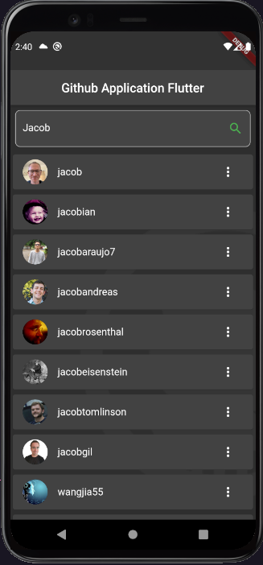
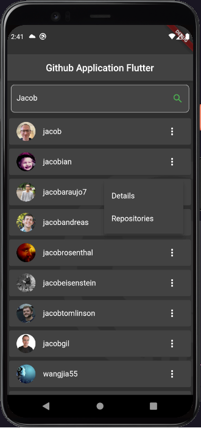
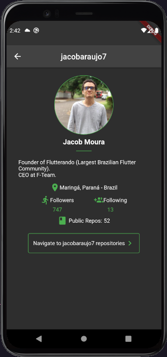
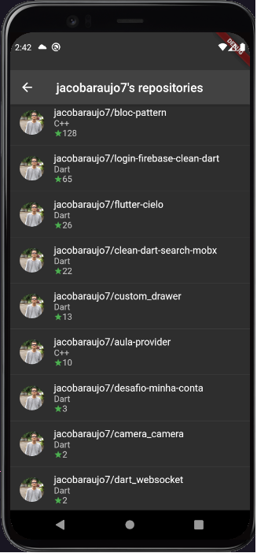

# GITHUB APPLICATION FLUTTER

**GITHUB APPLICATION FLUTTER é um aplicativo desenvolvido em FLUTTER**

Aplicação que permite você pesquisar usuários no Github, consultando detalhes do usuário e seus repositórios.
Para a consulta dos dados é utilizada a **API DO GITHUB**(https://developer.github.com/v3/).

---

---

## Instalação | Execução

Clone esse repositório rodando o comando:

    git clone https://github.com/MarthinKorb/github_application_flutter.git

Com o projeto aberto, execute os comandos:

    flutter pub get

e após:

    flutter run

---

# Sobre o ## Flutter

É um Framework de Dart para construir aplicações para a plataforma Android e Ios.

Quer saber mais sobre o _Flutter_? Acesse [https://flutter.dev/]

**Feito!** ✔

---
